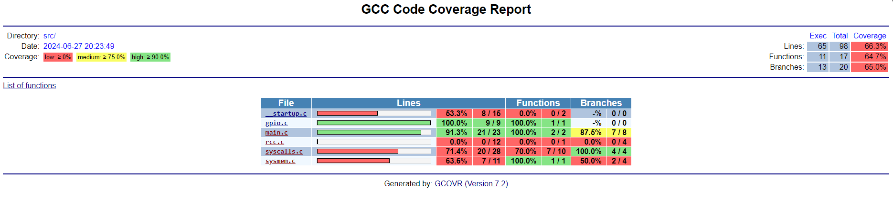
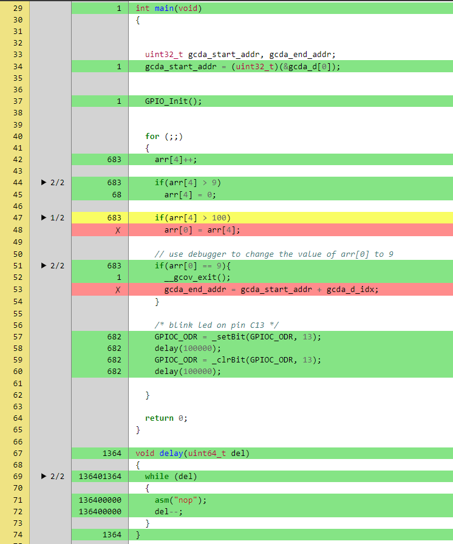

# Enabling Gcov in Freestanding Embedded Systems Project

This project is designed for performing code coverage analysis on an embedded MCU using [GCOV](https://en.wikipedia.org/wiki/Gcov).  
It details the process of capturing coverage data (`gcda files`) directly in the memory of the MCU, or an external Memory or stream the bytes over a communication channel like UART. 

This project is demonstrated using an `STM32F4` MCU, with `gcda` files stored as binary blobs in memory. However, the methodology is applicable to any MCU compatible with the arm-none-eabi toolchain, and the storage of `gcda` files can be achieved as previously mentioned.
After retrieval of this data we can perform analysis with help of `gcovr`.

Few snaps of the results can be seen below

**Figure: Gcov Report**



**Figure: main.c Coverage Results**


In the above image the report depicts how many times each lines were executed. The lines in the red were never executed.

## Prerequisites

- ARM GCC Toolchain.
- OpenOCD.
- [Gcovr](https://gcovr.com/en/stable/installation.html)
- Knowledge on how to program an STM32F4 from scratch. [STM32_F4-Baremetal-Basic](https://github.com/iiriis/STM32_F4-Baremetal-Basic). IDE users can ignore this.
- VSCode is optional

## Getting Started

### Project Configuration

1. **Syscalls stubs**

    Enable the primary syscalls stubs required by our GCOV library, `_write()`, `_read()`, `_open()`, `__io_putchar(int ch)`, `__io_getchar(void)`. 
    Gcov uses the `_open()` to open the file, and then uses `_write()` to write the gcda data to a file. The `_write()` syscall then uses the `__io_putchar(int ch)` to finally write the data. 
    We will modify the `__io_putchar(int ch)` function and retarget it to store the data to a memory location like an array. 
    
    *For example*

    ```C
    /* Array to hold the gcda data */
    volatile uint8_t gcda_d[4096];
    uint32_t gcda_d_idx;

    /* retargetted __io_putchar to store anything to the array */
    int __io_putchar(int ch){
        gcda_d[gcda_d_idx++] = ch;
    return ch;
    }
    ```
    We also need to modify the `_open()` syscall syscall to prepend the file name to the `gcda` data in the memory. This step is essential because each source file generates separate gcda data, and the file name acts as an identifier.

    *For example*

    ```C
    int _open(char *path, int flags, ...)
    {
        /* write any file names to the io-putchar */
        _write(0, path, strlen(path));
        return 0;
    }
    ```

    The layout of the binary blob will then look something like this

    ```bash
    C:\xxxx\main.gcda<gcda_content>
    ```

    >Please note that <gcda_content> represents the binary content of the `.gcda` data specific to the main.c source file.

2. **SBRK Stub** 

    Gcov uses malloc to allocate memory for the neccessary `.gcda` info. The Malloc relies on the `_sbrk` to request data space. We will implement a simple heap allocator to provide `_sbrk` suitable for our embedded environment. An example of this custom allocator is provided in[sysmem.c](src/sysmem.c)

3. **Ensure Constructor Calls**

    For GCOV to function correctly, it is essential to ensure that the static constructors in your code are called. <br>
    The constructors are vital for GCOV as they prepare the coverage counters and set up the necessary infrastructure for recording coverage data. Without this initialization, GCOV may not correctly record the execution paths taken during runtime. <br>
    These constructor functions are referred to by the linker via symbols originating from the linker script, which define the start and end of the `.init_array` section. The `__libc_init_array()` function, typically called from your startup code, iterates over this array, calling each constructor in turn. See the startup code in [__startup.c](src/__startup.c).

4. **Calling __gcov_exit()**

    To trigger the generation and storage of `.gcda` data, a call to the `__gcov_exit()` function is required. This function ensures that all the gathered coverage information is written out to the designated storage area. It is imperative that `__gcov_exit()` is called only once, after all runtime test cases have been executed and no further code coverage data needs to be collected.

    Careful placement of the `__gcov_exit()` call is recommended to avoid premature dumping of coverage data or incomplete data capture. Typically, it should be invoked at the very end of your test suite or just before your application terminates.

    Example usage is demonstrated in [main.c](src/main.c):


5. **Build with Coverage Flags**: Compile your embedded application with the `--coverage` flag to instrument the code for coverage analysis. Observe the `*.gcno` files generating after compilation.

6. **Linking GCOV**: Ensure the application is linked with GCOV library support. Add `--coverage` to your linker flags and, if necessary, `--specs=nosys.specs` for a systemless environment.

### Retrieval of Raw GCDA Data

Once the program has been executed, the `.gcda` coverage information will be stored in the `gcda_data` array within the RAM. To retrieve this data, you will need the starting address of the `gcda_data` array and the length of the data stored.

The starting address is simply the address of the `gcda_data` array, which can be obtained by referencing the address of the first element in the array. The length of the data is tracked by a counter that increments with each call to the `__io_putchar` function; this counter indicates the total number of bytes written. Utilizing a debugger such as OpenOCD, we can extract both the starting address and the written byte count from the debugger's expressions or variables.

An example implementation for tracking the size of the coverage data and depicting the start and the end address of the `gcda_data` array is provided in [main.c](src/main.c). The following steps outline the process:

1. Ensure `gcda_data_idx` is being used to track the number of bytes written to `gcda_data`.
2. Run the firmware in debug mode using OpenOCD.
3. Use the following OpenOCD command to perform a memory dump from the starting address of the array to the ending address, which is determined by adding `gcda_data_idx` to the starting address:

```bash
-exec dump binary memory dump.bin <gcda_data_array_start_address> <gcda_data_array_end_address>
```

The resulting `dump.bin` file will contain the raw binary `.gcda` data, ready to be analyzed.

### Converting Raw to Actual GCDA Data

A simple Python script has been developed to parse the `dump.bin` file and automatically generate separate `*.gcda` files, placing them in the corresponding paths where their respective `*.gcno` files are located. The information about the absolute paths of the `gcda` data is embedded within the `dump.bin` file during the `__gcov_exit()` call. The script can be found in [converter.py](./converter.py).

Run the python script by 

```bash
python converter.py
```

### Generating the Report

Finally generate the report using `gcovr`. Ensure `Gcovr` is installed. Execute the `gcovr` command from the root directory of your project to gather all the `*.gcno` and `*.gcda` files and compile them into a comprehensive HTML report. To keep things organised the report is generated inside the [Coverage](./Coverage/) folder.

>Note: It is crucial to specify the path to `arm-none-eabi-gcov` when invoking `gcovr`, otherwise it will default to using the system's `gcov` binary, which may yield undesired results.

*For Example*
```bash
gcovr -r . --html --html-details -o Coverage/coverage-report.html --gcov-executable ./path/to/arm-none-eabi-gcov
```

